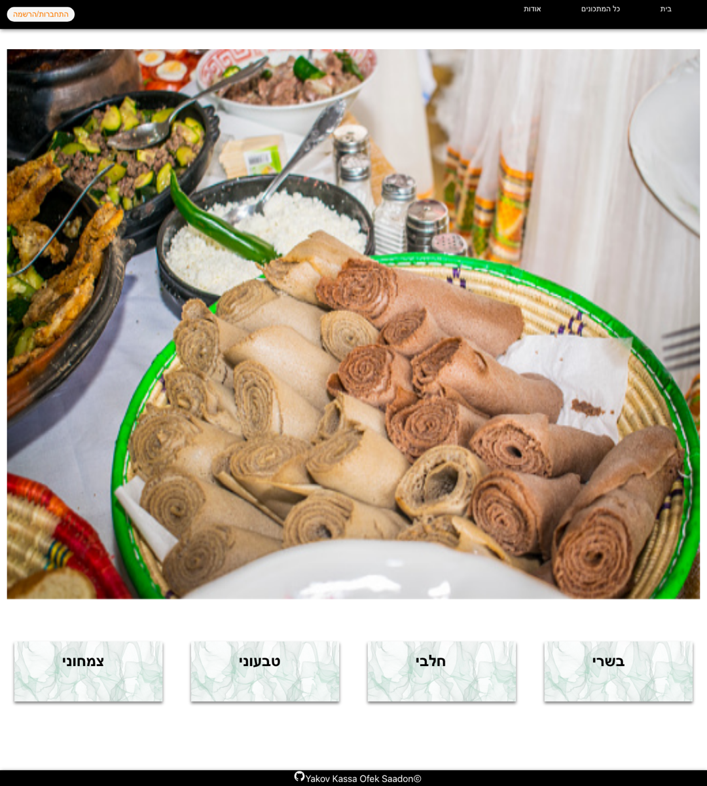

# Ethio Food

פלטפורמה קהילתית לשיתוף, חיפוש וניהול מתכונים מהמטבח האתיופי.  
המערכת נבנתה כדי לשמר ידע קולינרי, לאפשר למשתמשים להעלות מתכונים עם תמונות, ולנהל תהליך אישור לפני פרסום המתכונים לכלל המשתמשים.

## תוכן עניינים

- [על הפרויקט](#על-הפרויקט)
- [תצוגה מהאפליקציה](#תצוגה-מהאפליקציה)
- [יכולות מרכזיות](#יכולות-מרכזיות)
- [טכנולוגיות](#טכנולוגיות)
- [מבנה הפרויקט](#מבנה-הפרויקט)
- [התקנה והרצה מקומית](#התקנה-והרצה-מקומית)
- [משתני סביבה](#משתני-סביבה)
- [API מרכזי](#api-מרכזי)
- [בדיקות ואיכות](#בדיקות-ואיכות)
- [פריסה](#פריסה)
- [צוות הפיתוח](#צוות-הפיתוח)

## על הפרויקט

Ethio Food הוא יישום Full Stack המבוסס על React בצד הלקוח ו-Express בצד השרת.  
המערכת מאפשרת צפייה במתכונים, סינון לפי קטגוריות, חיפוש, הרשמה והתחברות, העלאת מתכונים אישיים, כתיבת תגובות וניהול מתכונים על ידי מנהל.

הפרויקט שם דגש על:

- שימור מתכונים ומסורת קולינרית של הקהילה האתיופית.
- חוויית משתמש פשוטה בעברית.
- הפרדה בין לקוח, שרת, בסיס נתונים ואימות משתמשים.
- הרשאות בסיסיות למשתמשים רגילים ולמנהלי מערכת.

## תצוגה מהאפליקציה



*דף הבית של המערכת, כולל תצוגת אוכל מסורתית וכניסה מהירה לקטגוריות המתכונים.*


*סינון מתכונים לפי קטגוריות מרכזיות: בשרי, חלבי, טבעוני וצמחוני.*

## יכולות מרכזיות

- צפייה בכל המתכונים שאושרו לפרסום.
- חיפוש מתכונים לפי שם, מקור, מצרכים, הוראות והערות.
- סינון מתכונים לפי קטגוריות: בשרי, חלבי, טבעוני וצמחוני.
- עמוד פרטים מלא לכל מתכון, כולל תמונה, מצרכים, הוראות הכנה, הערות ותגובות.
- הרשמה והתחברות באמצעות Firebase Authentication.
- העלאת מתכון חדש עם תמונה, קטגוריה וזמני אכילה מומלצים.
- אזור אישי למשתמשים: צפייה, עריכה ומחיקה של המתכונים שלהם.
- אזור ניהול למנהלים: צפייה בכל המתכונים, אישור מתכונים שממתינים לפרסום ומחיקה מכל תפריט.
- שמירת נתונים ב-MongoDB.
- העלאת תמונות לשרת עם בדיקות סוג קובץ וגודל קובץ.
- עמוד 404 ידידותי בעברית עבור כתובות לקוח שלא קיימות.

## טכנולוגיות

### Client

- React 17
- Vite
- React Router
- Axios
- React Icons
- React Spinners

### Server

- Node.js
- Express
- MongoDB
- Firebase Identity Toolkit
- Multer
- CORS
- dotenv

## מבנה הפרויקט

```text
ethio-food-main/
├── app.js                 # הגדרת שרת Express, CORS ונתיבי API
├── auth.js                # אימות Firebase והרשאות משתמשים
├── db.js                  # חיבור ל-MongoDB
├── uploadConfig.js        # הגדרת תיקיית העלאות, כולל תמיכה ב-UPLOAD_DIR
├── utilies.js             # לוגיקת מתכונים, תמונות, תגובות ואישורים
├── render.yaml            # Blueprint לפריסת API ו-Static Site ב-Render
├── routes/
│   ├── index.js           # נתיבי המתכונים והתמונות
│   └── users.js           # נתיב דמו למשתמשים
├── uploads/               # תמונות שהועלו דרך המערכת
├── public/                # קבצים סטטיים של השרת
├── client/
│   ├── src/
│   │   ├── pages/         # עמודי האפליקציה
│   │   ├── components/    # רכיבי ממשק משתמש
│   │   └── api.js         # הגדרת API ואימות בצד הלקוח
│   ├── public/
│   └── package.json
├── package.json           # תלות ופקודות צד שרת
└── Procfile               # הגדרת הרצה לסביבת ענן תומכת
```

## התקנה והרצה מקומית

### דרישות מקדימות

- Node.js בגרסה `16.20.0` ומעלה.
- npm.
- MongoDB זמין בענן או מקומית.
- פרויקט Firebase פעיל עבור הרשמה והתחברות.

### התקנת צד שרת

```bash
npm install
```

צרו קובץ `.env` בתיקיית השורש והגדירו את משתני הסביבה הדרושים. פירוט מלא מופיע בסעיף [משתני סביבה](#משתני-סביבה).

הרצת השרת:

```bash
npm run dev
```

ברירת המחדל של השרת:

```text
http://localhost:3001
```

בדיקת תקינות:

```text
http://localhost:3001/health
```

### התקנת צד לקוח

פתחו טרמינל נוסף:

```bash
cd client
npm install
```

צרו קובץ `.env` בתוך תיקיית `client` והגדירו את כתובת ה-API:

```env
VITE_API_URL=http://localhost:3001
```

הרצת הלקוח:

```bash
npm start
```

ברירת המחדל של Vite:

```text
http://localhost:5173
```

### פקודות שימושיות

```bash
# Server
npm start
npm run dev

# Client
cd client
npm start
npm run build
npm test
npm run preview
```

## משתני סביבה

### Server `.env`

```env
PORT=3001
MONGODB_URL=<your-mongodb-connection-string>
MONGODB_DB_NAME=ethyopianfood
CLIENT_ORIGINS=http://localhost:5173
FIREBASE_API_KEY=<your-firebase-api-key>
ADMIN_EMAILS=admin@example.com,another-admin@example.com
UPLOAD_DIR=/opt/render/project/src/uploads
```

| משתנה | חובה | הסבר |
| --- | --- | --- |
| `PORT` | לא | הפורט שעליו שרת ה-API ירוץ. ברירת מחדל: `3001`. |
| `MONGODB_URL` | כן | כתובת התחברות ל-MongoDB. |
| `MONGODB_DB_NAME` | לא | שם בסיס הנתונים. ברירת מחדל: `ethyopianfood`. |
| `CLIENT_ORIGINS` | מומלץ | רשימת כתובות לקוח שמורשות לפנות לשרת, מופרדות בפסיקים. |
| `FIREBASE_API_KEY` | כן | מפתח Firebase המשמש לאימות אסימוני משתמשים. |
| `ADMIN_EMAILS` | לא | רשימת כתובות אימייל של מנהלים, מופרדות בפסיקים. |
| `UPLOAD_DIR` | לא | תיקיית שמירת תמונות שהועלו. ברירת מחדל: `uploads` בתוך השרת. ב-Render מומלץ לחבר לתיקייה זו Persistent Disk. |

### Client `client/.env`

```env
VITE_API_URL=http://localhost:3001
VITE_FIREBASE_API_KEY=<your-firebase-api-key>
```

הפרויקט תומך גם בשמות הישנים `REACT_APP_API_URL` ו-`REACT_APP_FIREBASE_API_KEY`, אך בפרויקט Vite מומלץ להשתמש במשתנים שמתחילים ב-`VITE_`.

## API מרכזי

| Method | Endpoint | הרשאה | תיאור |
| --- | --- | --- | --- |
| `GET` | `/health` | ציבורי | בדיקת תקינות לשרת. |
| `GET` | `/recipes` | ציבורי | שליפת מתכונים שאושרו לפרסום. |
| `GET` | `/recipes?includePending=true` | מנהל | שליפת כל המתכונים, כולל מתכונים שממתינים לאישור. |
| `GET` | `/recipe/:id` | ציבורי / בעלים / מנהל | שליפת מתכון בודד. |
| `GET` | `/categories/:category` | ציבורי | שליפת מתכונים לפי קטגוריה. |
| `GET` | `/image/:newFileName` | ציבורי | שליפת תמונה שהועלתה לשרת. |
| `POST` | `/recipe` | משתמש מחובר | יצירת מתכון חדש עם תמונה. |
| `PATCH` | `/recipe/:id` | משתמש מחובר | עדכון מתכון או הוספת תגובה. תגובות למתכון שממתין לאישור מותרות רק לבעלים או למנהל. |
| `DELETE` | `/recipe/:id` | בעלים / מנהל | מחיקת מתכון. |
| `GET` | `/recipe/user/:localId` | בעלים / מנהל | שליפת המתכונים של משתמש מסוים. |
| `PATCH` | `/recipeApprove/:id` | מנהל | אישור מתכון לפרסום. |

בקשות שמצריכות משתמש מחובר צריכות לכלול כותרת:

```http
Authorization: Bearer <firebase-id-token>
```

## העלאת תמונות

המערכת תומכת בהעלאת תמונה אחת לכל מתכון:

- סוגי קבצים מותרים: `jpg`, `png`, `webp`, `gif`.
- גודל מקסימלי: `5MB`.
- שמות הקבצים נוצרים בצד השרת כדי למנוע שימוש בשם קובץ לא בטוח.
- אם מגדירים `UPLOAD_DIR`, השרת ישמור ויקרא תמונות מאותה תיקייה מוגדרת, בלי לשנות את כתובות ה-API.

## בדיקות ואיכות

הפרויקט כולל בדיקות בסיסיות לצד הלקוח:

- בדיקה שהניווט הציבורי נטען.
- בדיקה שנתיב לקוח לא קיים מציג את עמוד `PageNotFound`.
- בדיקה שכפתור מחיקה של מנהל מוסתר ממשתמש רגיל.
- בדיקה שכפתור מחיקה של מנהל מוצג למשתמש מנהל.

פקודות בדיקה מומלצות:

```bash
# Client tests
cd client
npm test
npm run build

# Server syntax checks
cd ..
node --check app.js
node --check routes/index.js
node --check utilies.js
node --check auth.js
```

## פריסה

ניתן לפרוס את הפרויקט כשני שירותים נפרדים:

### API Server

הגדרה מומלצת בשירות ענן כמו Render או Heroku:

```bash
npm install
npm start
```

יש להגדיר בסביבת הענן את משתני הסביבה של צד השרת, במיוחד:

- `MONGODB_URL`
- `CLIENT_ORIGINS`
- `FIREBASE_API_KEY`
- `ADMIN_EMAILS`
- `UPLOAD_DIR` אם מחברים Persistent Disk לשמירת תמונות לאורך זמן

### Client

הגדרה מומלצת כ-Static Site:

```bash
cd client
npm install
npm run build
```

תיקיית הפרסום:

```text
client/build
```

כדי שכתובות פנימיות כמו `/Details/:id`, `/Categories/:category` ונתיבים לא קיימים ייטענו דרך React Router, יש להגדיר Rewrite ב-Static Site:

```text
Source: /*
Destination: /index.html
```

בפריסה יש להגדיר:

```env
VITE_API_URL=<production-api-url>
VITE_FIREBASE_API_KEY=<firebase-api-key>
```

## צוות הפיתוח

- Yakov Kassa
- Ofek Saadon

הפרויקט נבנה כחלק מתהליך למידה ופיתוח Full Stack, עם דגש על שימור ושיתוף מתכונים מהמטבח האתיופי.
